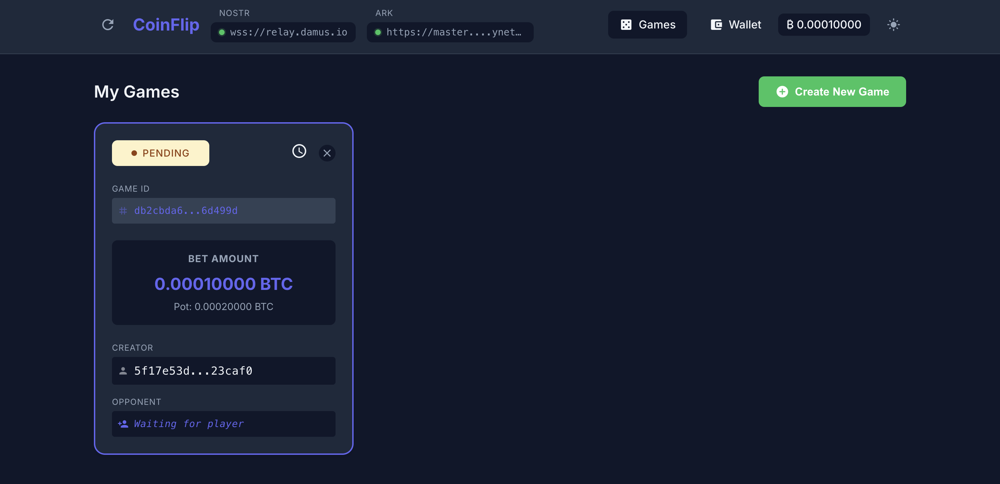
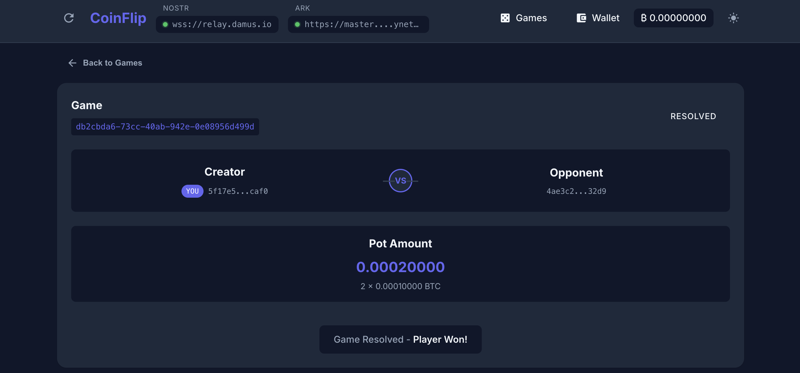

# CoinFlip

CoinFlip is a decentralized & trustless Bitcoin gambling game built on Ark and Nostr protocols. Players can create or join games with customizable bet amounts, competing head-to-head in a provably fair coin flip. 


*Browse available games and create new ones*


*View game details and play*

## How it works

CoinFlip uses Bitcoin's Taproot and Ark capabilities to create a trustless coin flip game between two players. The game mechanics are based on secret generation of predetermined sizes (15 bytes for "Heads", 16 bytes for "Tails").

The game is completely trustless - neither player can cheat or withhold funds once committed. For detailed technical explanation, visit: https://coinflip.casino/how-it-works

## Prerequisites

- Node.js (v14 or higher recommended)
- npm or yarn

## Installation

1. Install dependencies:

```bash
npm install
# or
yarn install
```

2. Run the development server:

```bash
npm run serve
# or
yarn serve
```

The application will be available at `http://localhost:8080`

## License

This project is licensed under the MIT License - see the [LICENSE](LICENSE) file for details.
